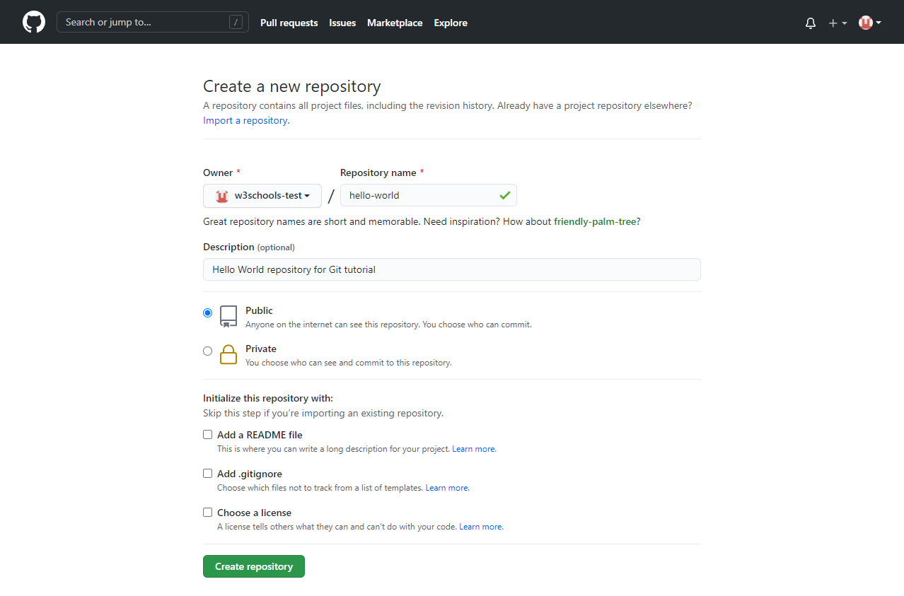
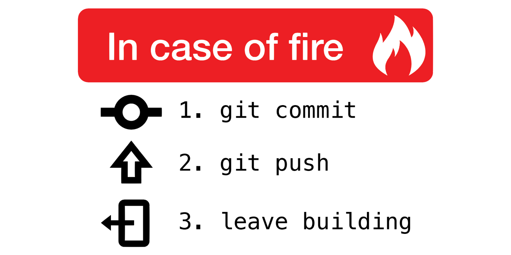
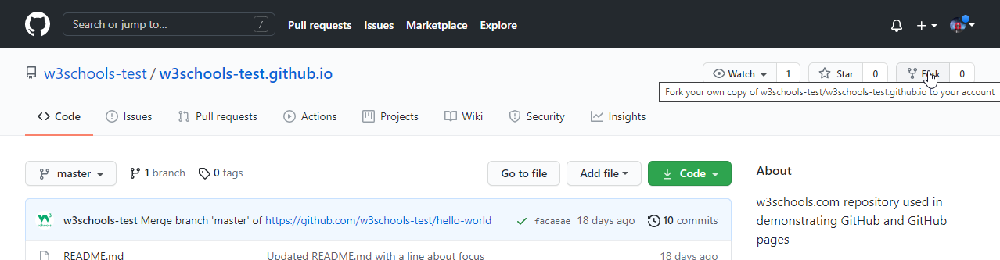
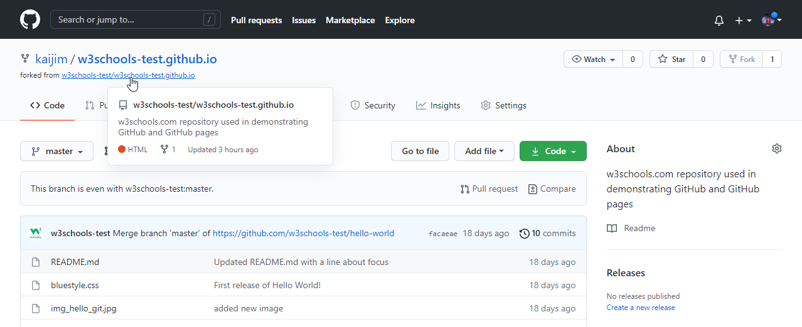
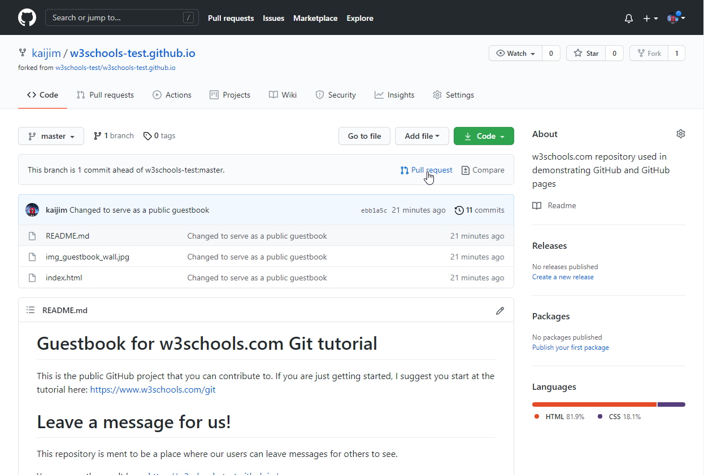
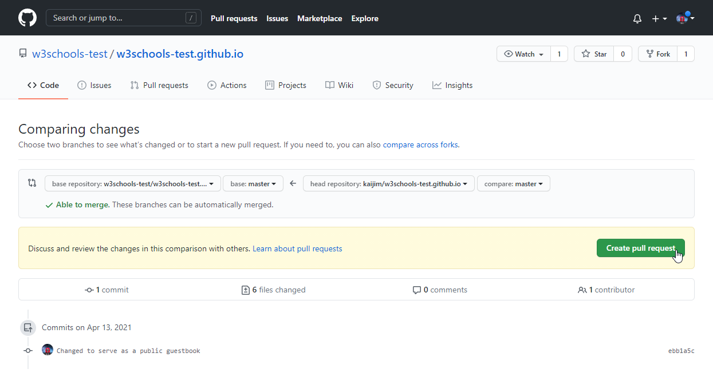
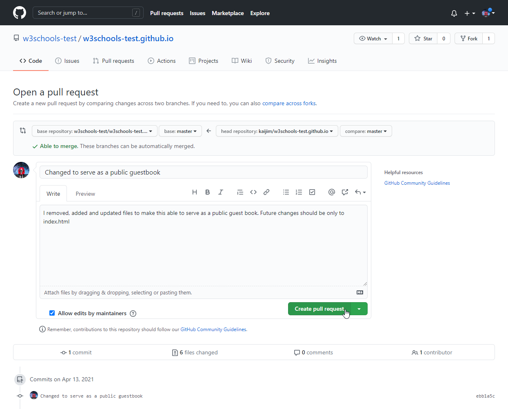
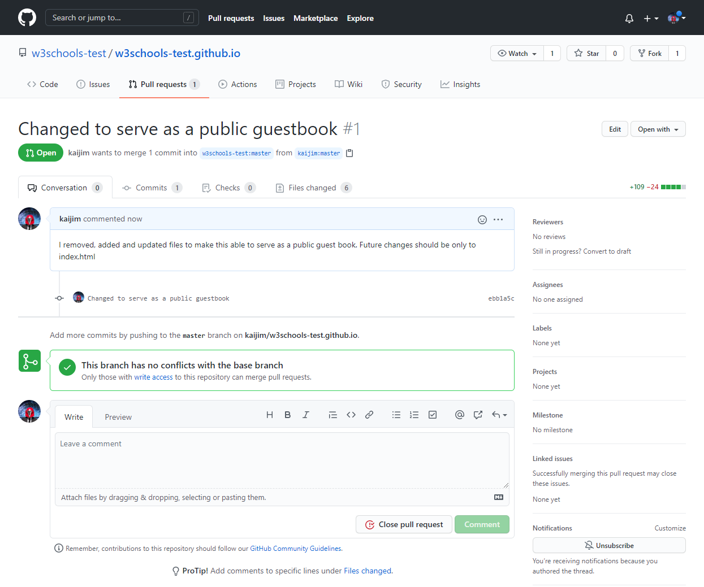

# Náplň cvičenia
- Úvod do Git a GitHub
- pokračovanie na zadaní 4


# Čo je Git
Je to systém na verziovanie programu, ktorý umožňuje:
- sledovanie zmien kódu
- sledovanie, kto robí dané zmeny
- zjednodušenie práce s projektom pri viacerých vývojároch

Aby sa dalo pracovať s git, treba ho najprv nainštalovať a nakonfigurovať.
```bash
# Inštalácia
Windows: https://git-scm.com/download/win # stiahnúť inštalátor a nainštalovať
Linux (Debian): sudo apt install git-all
Linux (RPM): sudo dnf install git-all
Mac: git --version # ak nie je nainštalovaný, tak by mal ponúknuť možnosť inštalácie

# Konfigurácia
git config --global user.name "<username>"
git config --global user.email "<email>"
```

# Čo je GitHub
Poskytovateľ internetového hostingu používajúci verzionovací nástroj Git, ktorý umožňuje:
- distribuované verzionovanie a správu zdrojového kódu
- grafické prostredie
- zadarmo obsluhovať verejný alebo privátny kód
- zálohovanie projektu na vzdialenom serveri

# Základné koncepty Git a prepojenie s GitHub

## Repozitár (Repository)
Predstavuje priečinok s kódom, ktorý bude sledovaný na zmeny. Vo vnútri tohto priečinka sa vytvorí nový skrytý priečinok `.git`, ktorý obsahuje všetko potrebné pre jeho fungovanie. 

Typy repozitárov:
- lokálný repozitár - pre sledovanie zmien bez zdielania a zálohy
- vzdialený repozitár na GitHub - záloha a pracovanie v grafickom prostredí GitHub
- vzdialený repozitár kdekoľvek - lokálne na inom disku, v inom priečinku, na serveri, ...

### Vytvorenie nového lokálneho repozitára
```bash
mkdir myproject
cd myproject
git init
```

### Vytvorenie nového vzdialeného repozitára
Najprv si treba vytvoriť účet na stránke [github.com](https://github.com/).

<p align="center">
    
</p>

<p align="center">
    
</p>

Vzdialený repozitár si vieme následne prepojiť s lokálnym repozitárom. Vďaka tomu môžeme robiť zmeny lokálne a keď sme s nimi spokojní, tak ich nahráme do vzdialeného repozitára.
```bash
git remote add origin <link to remote repository>
```

## Klonovanie projektu (Clone)
Klonovanie umožňuje pracovanie lokálne na vzdialenom repozitári. Pri klonovaní sa vytvorí kópia projektu aj so všetkými vetvami a zmenami.

```bash
git clone <repository_path>
```

## Sledovanie zmien (Staging) a uloženie zmien (Commit)
Keď vytvoríte zmenu v súbore, ktorý je sledovaný repozitárom, tak táto zmena je odpamätaná a môže byť zobrazená, uložená alebo zahodená. 

### Skontrolovanie zmien v repozitári
```bash
git status
On branch master

No commits yet

Changes to be committed:
  (use "git rm --cached ..." to unstage)
    new file: index.html
```

### Zobrazenie zmien v súboroch
```bash
git diff
diff --git a/README.md b/README.md
index d1d2dd3..aeef78b 100644
--- a/README.md
+++ b/README.md
@@ -37,10 +37,6 @@ Zadania odovzdajte **bez binariek** vo formáte zip/rar/tar do AIS do miesta odo

 

-# GPIO port
-<p align="center">
-    
-</p>

 ### Nastavenie vstupného pinu
 - typ vstupu: digitálny, analógový
```

### Pridanie pripravených zmien do plánovaného uloženia zmien (Commit)
```bash
# single file
git add index.html
# all changes
git add .

git status
On branch master
Your branch is up to date with 'origin/master'.

Changes to be committed:
  (use "git restore --staged <file>..." to unstage)
        modified:   README.md
        new file:   index.html
```

### Odstránenie už pripravených zmien
```bash
git rm --cached index.html
```

### Uloženie pripravených zmien
```bash
git commit -m "<message>"
[master 230a42a] Update README.txt
 1 file changed, 4 deletions(-)
```

### Odstránenie už uložených zmien
Pozor, toto použiť iba ak zmeny ešte nie sú na hrané na vzdialený repozitár, inak môže dôjsť k veľa konfliktom.
```bash
git reset --mixed origin/master
Unstaged changes after reset:
M       README.md
```

### Ignorovanie sledovania zmien
Nie všetky súbory chceme mať súčasťou sledovania zmien. Napríklad pri kompilovaných súboroch nevie git určiť zmeny vrámci súbora a tak musí pri každej zmene uložiť novú kópiu celého súboru, čím postupne projekt naberá na rozmeroch, čo je nežiadúce. <b>Nikdy</b> nenahrávajte na git veľké monolitické súbory.

Na ignorovanie súborov/priečinkov slúži schovaný súbor `.gitignore` vytvorený v priečinku, kde chceme použiť ignorovanie (môže ich byť teda aj viac).
```bash
# Ignoprovať súbor
index.html

# Ignorovať všetky súbory s prípojkou .log
*.log

# Ignorovať priečinok
images/

# Neignorovať súbor v ignorovanom priečinku
!images/cat.jpeg
```

## Vetvy (Branch) a ich spájanie (Merge)
Vetvy (Branch) slúžia na vytvorenie si kópie určitej verzie repozitára. Umožňujú rozdeliť prácu na menšie časti tak, že pre každú časť sa vytvorí samostatná vetva programu. Pomocou vetiev sa dá aj vrátiť naspäť na predchádzajúcu verziu projektu. Pri vykonaní zmien vo vetve sa táto vetva dá zlúčiť s inou (Merge), čím sa spoja všetky zmeny dokopy.

### Vytvorenie si novej vetvy (Branch)
Odporúča sa používať dostatočne deskriptívne názvy vetiev neobsahujúce diakritiku a medzery.

```bash
git branch <branch name>

# Zobrazenie si lokálnych vetiev
git branch
* master
  super-amazing-branch

# Zobrazenie si všetkých vetiev
git branch --all
* master
  super-amazing-branch
  remotes/origin/HEAD -> origin/master
  remotes/origin/master
  remotes/origin/zadanie_cv1
```

### Zmena vetvy na inú
Pri zmene vetvy sa nesmú vyskytovať neuložené zmeny súborov, ktoré by mohli konfliktovať s danou vetvou.

```
git checkout super-amazing-branch
Switched to branch 'super-amazing-branch'
M       README.md
```

### Spojenie zmien dvoch vetiev (Merge)
Po pridaní spravených zmien do danej vetvy (pozri Staging a Commits), sa tieto zmeny môžu spojiť s inou vetvou, napríklad `master`.
```bash
# Prepneme sa na cieľovú vetvu
git checkout master

# Spojíme zmeny
git merge super-amazing-branch
Updating a35d0bd..c3e01d9
Fast-forward
 README.md  | 4 ----
 index.html | 8 ++++++++
 2 files changed, 8 insertions(+), 4 deletions(-)
 create mode 100644 index.html
```

### Riešenie konfliktov pri spájaní vetiev
Počas spájania zmien môže dospieť ku konfliktom, kedy na obidvoch vetvách bola vykonaná zmena na tom istom výraze a teda sa nevie git rozhodnúť, ktorá zmena má byť platná.

Git vtedy pridá v daných súboroch ukazovatele konfliktu aj s oboma verziami a je na vývojárovi, aby tieto konflikty vyriešil. Cieľom je pritom odstrániť všetky ukazovatele konfliktu v kóde tak, aby kód zostal požadovaný. Merge conflikt sa ukončí keď sú všetky konflikty vyriešené, súbory pridané na uloženie a commitnuté.

```bash
# Spravili sme rozdielnu zmenu v oboch vetvách a chceme ich spojiť
git merge super-amazing-branch  
Auto-merging index.html
CONFLICT (content): Merge conflict in index.html
Automatic merge failed; fix conflicts and then commit the result.

# Vidíme, že konflikt je v súbore index.html
git status
On branch master
Your branch is ahead of 'origin/master' by 2 commits.
  (use "git push" to publish your local commits)

You have unmerged paths.
  (fix conflicts and run "git commit")
  (use "git merge --abort" to abort the merge)

Unmerged paths:
  (use "git add <file>..." to mark resolution)
        both modified:   index.html

no changes added to commit (use "git add" and/or "git commit -a")

# A takto vyzerá daný konflikt v súbore. 
# Všimnite si <<<<<<< HEAD , čo značí začiatok konfliktu
# Potom následuje verzia kódu v aktuálnej vetve, ukončené výrazom =======
# Následne je verzia kódu vo vetve, ktorú sa snažíme pridať do danej vetvy, ukončená výrazom >>>>>>> super-amazing-branch
git diff index.html
diff --cc index.html
index d7cae91,e19790b..0000000
--- a/index.html
+++ b/index.html
@@@ -1,5 -1,5 +1,9 @@@
  body {
++<<<<<<< HEAD
 +    background-color: lightgreen;
++=======
+     background-color: lightgray;
++>>>>>>> super-amazing-branch
  }

  h1 {
```

## Odloženie zmien na neskôr (Stash)
Zmeny v kóde si môžete okrem commitu odpamätať aj na neskôr. Na to slúži Stash, kde sa dajú schovať zmeny, pracovať na niečom inom a potom naspäť ich pridať. Taktiež to umožňuje presun zmien medzi vetvami bez ich spájania.

### Uloženie súborov do Stash
```bash
# Pridanie všetkých zmien do stash
git stash
Saved working directory and index state WIP on master: f41394c lightgreen

# Uloženie iba určitých súborov
git stash push <filenames>

# Zobrazenie uložených stash
git stash list
stash@{0}: WIP on master: f41394c lightgreen

# Zobrazenie zmien v stash
git stash show stash@{0}
 index.html | 2 +-
 1 file changed, 1 insertion(+), 1 deletion(-)
```

### Použitie zmien zo stash
Pri aplikovaní zmien taktiež môže dôjsť ku konfliktom, ktoré nedovolia jej aplikovanie.

```bash
# Posledných zmien s vymazaním stash
git stash pop
On branch master
Your branch is ahead of 'origin/master' by 2 commits.
  (use "git push" to publish your local commits)

Changes not staged for commit:
  (use "git add <file>..." to update what will be committed)
  (use "git restore <file>..." to discard changes in working directory)
        modified:   README.md
        modified:   index.html

no changes added to commit (use "git add" and/or "git commit -a")
Dropped refs/stash@{0} (77c80bc9434e65e420261643f086f4031feb7361)

# Posledných zmien bez vymazania
git stash apply

# Aplikovanie zmien z kontrétnej stash
git stash apply stash@{0}

# Vymazanie stash
git stash drop stash@{0}
```

## Získanie poslednej verzie (Pull) a nahrávanie lokálnych zmien (Push)

### Získanie poslednej verzie (Pull)
Keď viacerí pracujú na rovnakom projekte, je dôležité, aby všetci pracovali na čo najaktuálnejšej verzii projektu. Na to slúži možnosť stiahnúť si všetky posledné zmeny, ktoré sú vo vzdialenom repozitári.

```bash
# Stiahnutie zmien vetvy bez aplikovania (nepovinné)
git fetch

# Stiahnutie zmien vetvy a aplikovanie (fetch + merge)
git pull
```

### Nahrávanie lokálnych zmien (Push)
Keď sú spravené zmeny vo vetve, tak ich môžeme nahrať na vzdialený repozitár. To umožňuje ostatním vývojárom projektu stiahnúť si aktuálnejšiu verziu projektu a taktiež sú tieto zmeny zazálohované.

```bash
git push
```

<p align="center">
    
</p>

## Spolupracovanie na projekte (Contribute)
GitHub ponúka možnosť spraviť si kópiu repozitára pod vlastný účet. To umožňuje spraviť lokálne zmeny vo vlastnom repozitári a potom ponúknuť možnosť originálnemu repozitáru integrovať tieto zmeny. Taktiež to umožňuje oddeliť sa úplne od originálneho repozitára a vytvoriť na jeho základe nový projekt.

<p align="center">
    
</p>


### Vytvorenie si kópie repozitára pod vlastným účtom (Fork)
<p align="center">
    
    
</p>

### Príprava repozitára
Keď máme vlastný vzdialený repozitár, tak si ho taktiež vytvoríme lokálne. Na to ale aby bol stále prepojený s originálnym vzdialený repozitárom, treba nastaviť ich prepojenie (Remote).

Najprv teda naklonujeme <b>originálny</b> repozitár. Potom skontrolujeme, že repozitár smeruje správne na originálny vzdialený repozitár.
```bash
git clone https://github.com/w3schools-test/w3schools-test.github.io.git

cd w3schools-test.github.io

# Vypísanie aktuálnych remote
git remote -v
origin  https://github.com/w3schools-test/w3schools-test.github.io.git (fetch)
origin  https://github.com/w3schools-test/w3schools-test.github.io.git (push)
```

Potom nastavíme náš repozitár ako `origin` a originálny repozitár ako `upstream`.
```bash
# Premenovanie originálneho remote
git remote rename origin upstream

git remote -v
upstream        https://github.com/w3schools-test/w3schools-test.github.io.git (fetch)
upstream        https://github.com/w3schools-test/w3schools-test.github.io.git (push)

# Pridanie našeho remote
git remote add origin https://github.com/kaijim/w3schools-test.github.io.git

git remote -v
origin  https://github.com/kaijim/w3schools-test.github.io.git (fetch)
origin  https://github.com/kaijim/w3schools-test.github.io.git (push)
upstream        https://github.com/w3schools-test/w3schools-test.github.io.git (fetch)
upstream        https://github.com/w3schools-test/w3schools-test.github.io.git (push)
```

### Ponúknutie zmien na pridanie do originálneho repozitára (Pull Request)
Keď spravíme zmeny v našom repozitári a pushneme ich do našeho vzdialeného repozitára, GitHub ponúkne možnosť vytvoriť Pull Request s týmito zmenami. Keď originálny autor alebo jeden z určených ľudí akceptute túto zmenu, môže byť pridaná do repozitára (Merge).

Zásady pri spolupracovaní:
- buďte slušní a trpezliví
- snažte sa výstižne popísať spravené zmeny tak, aby sa dalo rýchlo pochopiť zmenenému kódu, čo aj zrýchľuje akceptovanie zmien
- väčšina verejných repozitárov obsahuje súbor `CONTRIBUTING.md` alebo podobne, obsahujúci zásady spolupracovania na danom projekte, treba sa nimi riadiť

<p align="center">
    
    
    
    
</p>

# Licencovanie projektu
Bez licencie každý kód podlieha predvolenej licencii, ktorá hovorí, že daný kód je tebou vlastnený a nikto nemôže reprodukovať, ditribuovať alebo meniť tvoju prácu. Pre vytvorenie Open Source projektu, tento projekt musí obsahovať jednu z licencií, ktoré umožňujú iným používateľom narábať s daným projektom. Je teda dôležité poznať rôzne typy licencií, lebo s nesprávnym narábaním s cudzím kódom môže hroziť žaloba. V repozitári viete väčšinou nájsť licenciu pod názvom ako `LICENSE.md`.

Niektoré typy open source licencií:
- MIT - robte čo chcete, len ma nežalujte
- Apache - rovnaké ako MIT, len viac slov
- BSD - rovnaké ako MIT, obsahuje tri verzie (2 = MIT, 3 = treba povolenie pre zverejnenie tvojho mena, 4 = tvoje meno/značka musia byť súčasťou všetkých propagačných materiálov)
- GPL - každá derivačná práca musí byť zverejnená tiež s GPL licenciou

# Užitočné linky
- [GitHub](https://github.com/)
- [GitLab](https://about.gitlab.com/)
- [git](https://git-scm.com/)
- [Git and GitHub Introduction by w3school](https://www.w3schools.com/git/git_intro.asp?remote=github)
- [Collection of useful .gitignore templates](https://github.com/github/gitignore)
- [Open source licenses](https://gist.github.com/nicolasdao/a7adda51f2f185e8d2700e1573d8a633)
